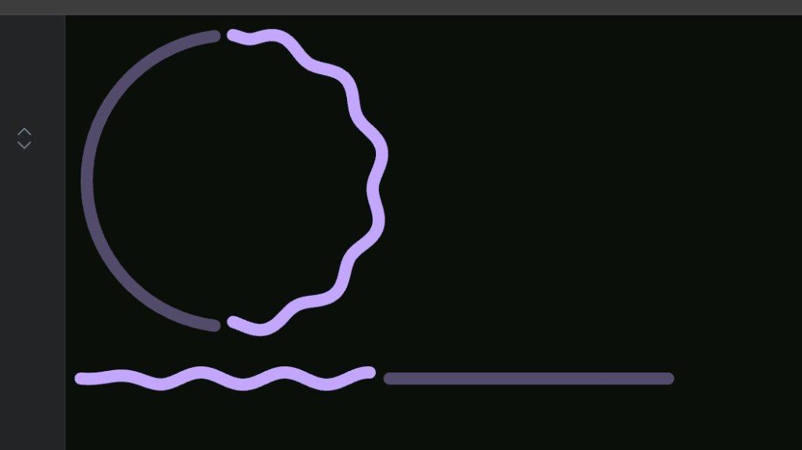

# wavy-loader

React progress components with animated wavy strokes. Built with TypeScript and Vite. Ready to publish to npm.

## Preview



## Installation

```bash
yarn add wavy-loader
```

## Components

### `Progress`

Linear progress bar with a wavy animated fill and optional track.

```tsx
import { Progress } from "wavy-loader";

function App() {
  const [progress, setProgress] = useState(0);
  return <Progress progress={progress} />;
}
```

| Prop               | Type   | Default   | Description                          |
| ------------------ | ------ | --------- | ------------------------------------ |
| `progress`         | number | 0         | Progress value (0–100)                |
| `speed`            | number | 0.01      | Wave animation speed                 |
| `width`            | number | 400       | Width (px)                           |
| `height`           | number | 40        | Height (px)                          |
| `stroke`           | number | 8         | Stroke width (px)                    |
| `amplitude`        | number | 4         | Wave amplitude (px)                  |
| `headRampFraction` | number | 0.28      | Ramp-in fraction at the wave head   |
| `trackColor`       | string | `#524B6B` | Background track color               |
| `color`            | string | `#c3a6ff` | Progress stroke color                |

---

### `CircularWavyProgress`

Circular progress indicator with a wavy animated stroke.

```tsx
import { CircularWavyProgress } from "wavy-loader";

function App() {
  const [progress, setProgress] = useState(50);
  return <CircularWavyProgress progress={progress} />;
}
```

| Prop         | Type   | Default   | Description                |
| ------------ | ------ | --------- | -------------------------- |
| `progress`   | number | 100       | Progress value (0–100)     |
| `size`       | number | 220       | Diameter (px)              |
| `stroke`     | number | 8         | Stroke width (px)         |
| `speed`      | number | 0.005     | Wave animation speed      |
| `trackColor` | string | `#524B6B` | Background track color    |
| `color`      | string | `#c3a6ff` | Progress stroke color     |

## Project structure

```
wavy-loader/
├── src/
│   ├── index.tsx              # Public exports
│   ├── demo.tsx               # Dev demo (yarn dev)
│   ├── vite-env.d.ts
│   ├── hooks/
│   │   └── usePhase.ts        # Animation phase hook
│   └── wavy-loader/
│       ├── Circular.tsx       # CircularWavyProgress
│       └── Progress.tsx       # Progress (linear)
├── index.html
├── package.json
├── tsconfig.json
├── tsconfig.node.json
├── vite.config.ts
├── README.md
└── assets/
    └── preview.png
```

## Development

```bash
yarn install
yarn dev     # Run demo at http://localhost:5173
yarn build   # Build library to dist/
yarn preview # Preview production build (if using demo build)
```

## Publishing to npm

1. Sign up at [npmjs.com](https://www.npmjs.com).
2. Log in: `npm login`.
3. Build: `yarn build`.
4. Publish: `npm publish` or `yarn publish`.

For a scoped package (e.g. `@yourname/wavy-loader`), set `"name": "@yourname/wavy-loader"` in `package.json` and run `npm publish --access public`.
